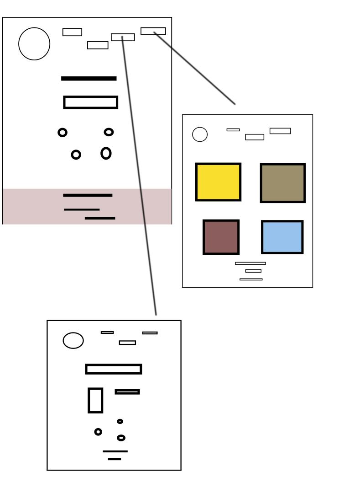

# \Sanne's Home Page

## Steps

- [\Sanne's Home Page](#sannes-home-page)
  - [Steps](#steps)
  - [1. First Interview](#1-first-interview)
  - [interview summary](#interview-summary)
  - [2. Follow-Up Interview](#2-follow-up-interview)
  - [interview breakdown](#interview-breakdown)
  - [information gained](#information-gained)
    - [personal details](#personal-details)
    - [personal strengths in regards to technology](#personal-strengths-in-regards-to-technology)
    - [webpage concept](#webpage-concept)
    - [webpage design - style](#webpage-design---style)
    - [webpage design - details](#webpage-design---details)
    - [development strategy](#development-strategy)
  - [3. Capture Findings](#3-capture-findings)
    - [Needs](#needs)
    - [Insights](#insights)
  - [4. Define the Problem](#4-define-the-problem)
  - [5. Open-Ended Ideation](#5-open-ended-ideation)
  - [6. Partner Feedback](#6-partner-feedback)
  - [7. Plan](#7-plan)
  - [8. Design](#8-design)
  - [9. Final Feedback](#9-final-feedback)

---

## 1. First Interview

1st interview summary -sanne

## interview summary

- q: can i record our conversation?

  > yes.

- q: tell me a bit about your BG (professional, academic, technical)

  > Currently an independent business owner, gives spin lessons online, works
  > additionally as PR for online companies (5 years xp). in past worked as
  > flight attendant for 15 years.

- q: Why/how did you get into these fields?

  > Comes from pilot/attendant family. Enjoys teaching spin because classes are
  > freeform and suitable to learners of varying BGs. likes working in PR for
  > the opportunities of social media. Interested in new technologies, finds
  > that they "make sense".

- q: Why are you interested in making a change professionally?

> left work as flight attendant to start a family. Interested in learning new
> things.

- q: What are your ambitions towards the future/future work?

> Wants work/family life balance. Working mother. Prefers flexibility with
> hours, ability to set on schedule. Can survive without work, but wants to
> work. Gets bored when doing nothing.

- q: What brought you to HYF?

> Love of technology, self directed, likes learning by doing, trial and error.
> Interested in the opportunities HYF brings, appreciates the professional
> guidance.

- q: How would you like to present yourself to the world?

> Core values, Who I am, my strengths, can be used as portfolio - "fancy", shows
> interests outside of work, keep simple

- q: How would you like to express these things (theme/style)?

> "Warm" website, somewhere you want to stay and explore, draws you in,
> "Scandinavian" design, nice and crisp, clean lines.

---

## 2. Follow-Up Interview

follow up interview - sanne

## interview breakdown

- questions focused on sharpening information gained from 1st interview

- spoke in more depth about webpage layout, planning strategy and design

## information gained

### personal details

- has 1 child, not interested in having more children
- went 'opposite way' in terms of career destination

### personal strengths in regards to technology

- natural troubleshooter, likes simplicity in tech, ux/ui, annoyed by overly
- complex layouts, a logical thinker, is in 'honeymoon' stage as coder, needs
- passion to become coder, optimistic

### webpage concept

- being a developer, webpage is a business card, 1st impression,
- should be kept simple, not 'play all aces' at once, a jumping off point,
- gives idea of skills/abilities

### webpage design - style

- warm;

  > colors - off-white(?), font - rounded letters

- architecture;

  > clean lines, simple

- challenge is finding balance between cleanness and warmth

### webpage design - details

- header + footer
- numerous pages
- menu (dropdown?)
- portfolio on own page

### development strategy

> find example websites, good and bad, to use as visual references

---

## 3. Capture Findings

<!-- Take some time to consolidate & summarize what you learned in the previous two interviews. -->

### Needs

<!-- What exactly does your partner need from their home page? Are they looking for collaborators? A job?Learning opportunities? Or something you never expected? -->

### Insights

<!-- New learnings about your partner to use in your design -->

---

## 4. Define the Problem

<!--
  In your own words describe:

  - Why does your partner need this home page?
  - How do they want to be represented?
  - Who do they want to visit their page?
  - What do they want different visitors to see them?

  A useful format:

  - _partner's name_ needs a way to _?_.
    - Unexpectedly, in their world, _?_.
-->

---

## 5. Open-Ended Ideation

- 
- ...

---

## 6. Partner Feedback

<!-- Discuss your ideas with your partner. lots of `why?`. -->

---

## 7. Plan

<!-- With your partner, come up with a Backlog and Wireframe for their Home page -->

---

## 8. Design

<!-- Propose an Atomic Design for your partner's home page. This could include a color palate, button designs, icons, ... -->

---

## 9. Final Feedback

<!--
  The Design Process is never finished!

  After you've finished the Plan & Design ask your partner for feedback. In a professional setting this would be the beginning of a whole new development cycle.
-->
